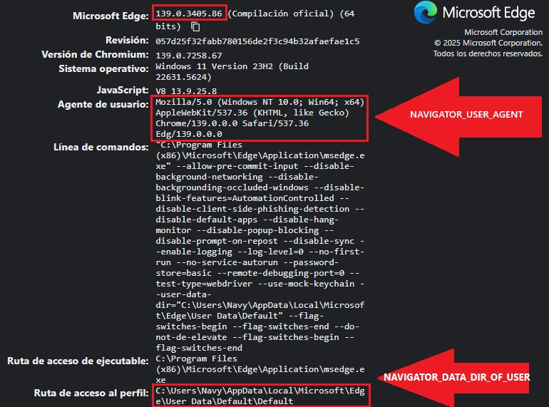
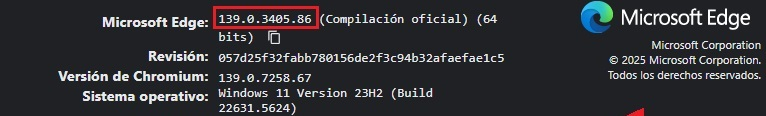
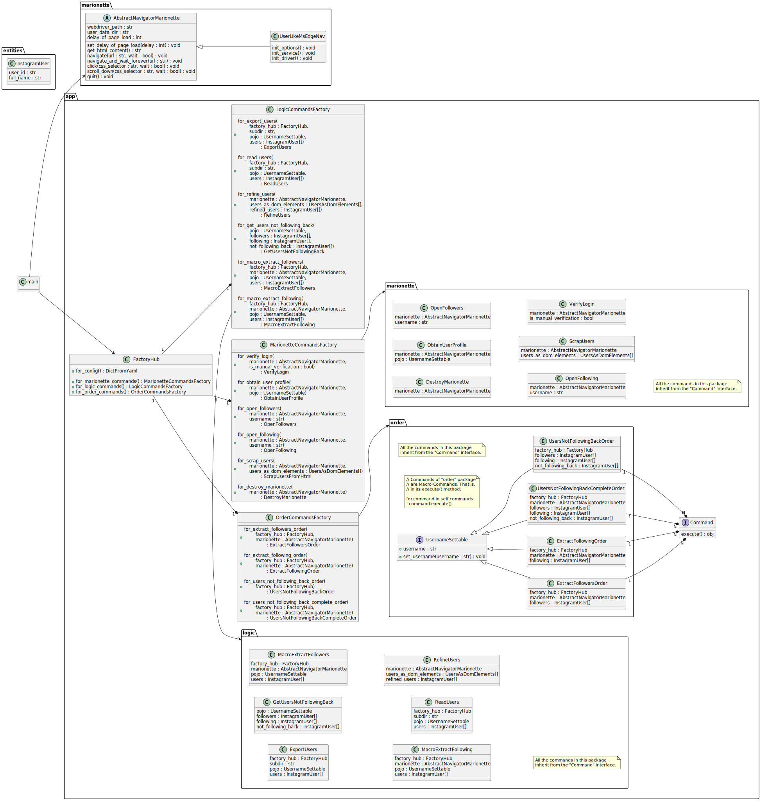

# 📸 InstaCrawler

Would you like to automatise crawling tasks on Instagram? **InstaCrawler** is your automated sidekick! 🤖

This app makes use of a Selenium WebDriver marionette to simulate user inputs, while BeautifulSoup is used to crawl the HTML DOM content of the Instagram webpage.

Last tested with Python 3.12.6 🐍 on PowerShell 7.5.2.0 (Windows 11 23H2).

Feel free to [contact me](mailto:ial.navy@protonmail.ch)!

## ⚠️ DISCLAIMER!

- FOR PERSONAL USE ONLY! ⚠️
- Use responsibly and respect Instagram’s terms of service! 🙏

## ✨ Features

- 🤖 Automated (or manual) Instagram login.
- 📋 Scrape followers & following lists.
- 🚦 Spot who’s not following you back.
- 🖥️ Uses Microsoft Edge WebDriver for browser automation.
- ⚙️ Customizable scraping speed & browser profile.

All while mimicking real human browsing to stay under the radar! 🕵️‍♂️

## 📖 Guide of Use

### 🛠️ Requirements

- Python 3.8+
- Microsoft Edge browser 
- Microsoft Edge WebDriver (`msedgedriver.exe`)
- Instagram account

IMPORTANT! ⚠️
Your Instagram log-in info **will be stored locally on your computer**.
InstaCrawler **does not store your info on the cloud**.


### 🚀 Installation

1. **Clone the repo**
   ```sh
   git clone <your-repo-url>
   cd InstaCrawler
   ```

2. **Install dependencies**
   ```sh
   pip install -r requirements.txt
   ```

3. **Configure environment variables**  
   Edit the `.env` file to configure the environment variables.
   
   **It is mandatory** setting the parameters related to your Web browser version specifications.

   Example:
   ```
   NAVIGATOR_DATA_DIR_OF_USER=C:\Users\<YOUR_WINDOWS_USERNAME>\AppData\Local\Microsoft\Edge\User Data\Default
   NAVIGATOR_WEBDRIVER_PATH=D:\path\to\msedgedriver.exe
   NAVIGATOR_USER_AGENT=Mozilla/5.0 (Windows NT 10.0; Win64; x64) AppleWebKit/537.36 (KHTML, like Gecko) Chrome/139.0.0.0 Safari/537.36 Edg/139.0.0.0
   ```

   
   
   You may also adjust time parameters as you wish. Modifying this is not recommended, unless you know what you are doing. These time parameters have been thoroughly tailored, so this application is able to run independently of the PC specs.

   Extremely low PC specs, or Internet connection, could require an increment of these values, so these defined wait times let the Instagram Webpage load for each step.
   
   You may also want to reduce these time values, so the apps works faster, if you have extremely good conditions, but do not try your luck, you could be mistaken as a DDoS attack by the Instagram servers.

   Example:
   ```
   TIMES_TO_SCROLL_DOWN_USER_CONTAINER=25
   SECONDS_TO_WAIT_AFTER_SCROLL=0.1
   SECONDS_TO_WAIT_FOR_USERS_CONTAINER_TO_LOAD=1.5
   ```

### 📜 Prerequirements

The version of your MS Edge navigator **must match** with that of your `msedgedriver.exe`.

You may find the version of you MS Edge navigator in this URL: `edge://version/`.



You may find the MS Edge WebDriver executable file for your specific version in the [MS Edge WebDriver versions directory](https://msedgewebdriverstorage.z22.web.core.windows.net/).

### 🏁 Usage

Run the main script with a command:

```sh
python main.py <order>
```

IMPORTANT! ⚠️
This app has been tested with PowerShell. **Do not execute Powershell as administrator!**

#### 📚 Available Orders

- `help` — Show usage info.
- `manual_login` — Open Instagram for manual login (if you want to change the logged-in account, for example).
- `not_following_back` — List users you follow who don’t follow you back.

You need to log-in into Instagram before you invoke any operation; that is why we have the "manual_login" operation. Your log-in info will be stored among the `NAVIGATOR_DATA_DIR_OF_USER` folder contents.

#### 💡 Example

```sh
python main.py manual_login
# A browser window will be opened.
# Log in to Instagram, then close that window.

python main.py not_following_back
# See who’s not following you back!
# The more followers / following users your account has,
# the more time this operation will take.
```

## ℹ️ Advanced Information of the Application

### 🏗️ Design & Architecture

#### Cause

Although Python is not traditionally classified as a purely OOP language, I have chosen to adopt an architecture grounded in this paradigm. This decision is driven by the desire to introduce a high level of standardization and modularity into the application's design. By leveraging OOP principles, such as encapsulation, inheritance, and polymorphism, the codebase becomes more maintainable, scalable, and easier to understand.

Furthermore, this approach aligns well with the design philosophies outlined in the [GoF design patterns](https://en.wikipedia.org/wiki/Design_Patterns). These patterns offer proven solutions to common software design problems and promote best practices in software engineering. By integrating these patterns into the architecture, the application benefits from a robust and consistent structure that enhances both development efficiency and long-term code quality.

#### Description of the Design & Architecture

The application's architecture is built around the [Command design pattern](https://en.wikipedia.org/wiki/Command_pattern), leveraging its Macro-Command variant to deliver a highly modular and extensible solution. Each terminal instruction is encapsulated as a Macro-Command — a structured sequence of individual Commands, each representing a distinct operational step. This approach offers several key benefits:

- **Decoupling of responsibilities**: Commands encapsulate specific actions, allowing the system to separate the logic of executing operations from the objects that invoke them.
- **Reusability and composability**: Individual Commands can be reused across different Macro-Commands, promoting cleaner code and reducing duplication.
- **Flexibility through strategy integration**: Each Command can incorporate its own strategy, enabling dynamic behavior customization without altering the core structure.
- **Ease of extension and maintenance**: New functionality can be added simply by introducing new Commands or modifying existing ones, without disrupting the overall system.
- **Support for undo/redo and logging**: The Command pattern naturally supports features like undo/redo operations and action logging, which are valuable in complex applications.

By adopting this pattern, the application gains a robust and scalable foundation that simplifies command execution, enhances maintainability, and empowers future growth.

Each command object is instantiated by an abstract factory object, following the [Abstract Factory pattern](https://en.wikipedia.org/wiki/Abstract_factory_pattern). This abstract factory object is instantiated just once, and it is common to the whole application, which also follows (ideally) the [Singleton pattern](https://en.wikipedia.org/wiki/Singleton_pattern). Each command, being created by its corresponding method of the command factory, performs a given operation, whose implementation could be easily modified just by swapping the class instantiated in that method.

The Selenium WebDriver marionette is encapsulated inside a hierarchy headed by the abstract class `AbstractNavigatorMarionette`. This abstract class defines several abstract methods `init_<xxx>`, which are intended to initialise common configuration for the Marionette. These methods are invoked in the constructor of this abstract class, and must be overriden by each concrete class. This is an application of the [Template method pattern](https://en.wikipedia.org/wiki/Template_method_pattern).

```py
    @abstractmethod
    def init_<xxx>(self):
        pass # To be overriden
```

The `InstagramUser` class helps me define the `str()` method as I wish, for the entry of each Instagram user found in the output list. There is another type in the diagram called `UsersAsDomElements`, which may be a type of BeautifulSoup idk.



For the sake of understanding, this UML class diagram depicts all the classes involved in just the `not_following_back` order.

The information described in this section may defer with the current implementation because of newer changes being implemented in the application. If that is the case and you find any mismatch, I beg you to report it to me.

### 🔮 Envisaged Extensions

- [ ] Replace the `InstagramSelectors` class with a YAML file.
- [ ] Add support for other browsers (Chrome, Firefox, etc.)
- [ ] Implement headless mode for background operation
- [ ] Export results to CSV or Excel
- [ ] Add more Instagram automation features (e.g., auto-like, auto-comment, auto-download of images and videos)
- [ ] Support for multi-account management

Future changes of the Instagram UI from Meta may require updates, such as to selectors in [`entities/InstagramSelectors.py`](entities/InstagramSelectors.py).

Feel free to suggest or contribute new by creating issues in this repo!

### ⚖️ License

This project is licensed under the terms of the [GNU General Public License v3.0](https://www.gnu.org/licenses/gpl-3.0.html).

You are free to use, modify, and distribute this software under the conditions of the GPLv3.  
See the [LICENSE](LICENSE) file for details.
