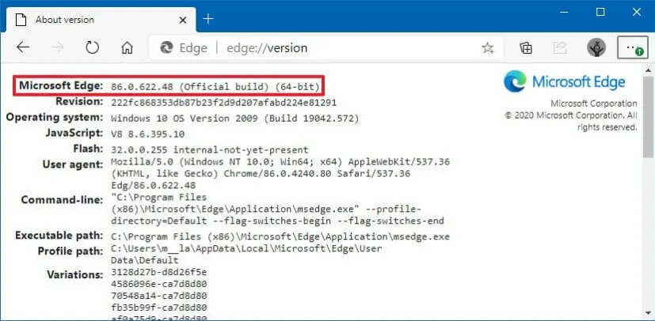

# 📸 InstaCrawler

Would you like to automatise crawling tasks on Instagram? **InstaCrawler** is your automated sidekick! 🤖

Last tested with Python 3.12.6 🐍 on PowerShell 7.5.2.0 (Windows 11 23H2).

---

## ✨ Features

- 🤖 Automated (or manual) Instagram login.
- 📋 Scrape followers & following lists.
- 🚦 Spot who’s not following you back.
- 🖥️ Uses Microsoft Edge WebDriver for browser automation.
- ⚙️ Customizable scraping speed & browser profile.

All while mimicking real human browsing to stay under the radar! 🕵️‍♂️

---

## 🛠️ Requirements

- Python 3.8+
- Microsoft Edge browser 
- Microsoft Edge WebDriver (`msedgedriver.exe`)
- Instagram account

IMPORTANT! ⚠️
Your Instagram log-in info **will be stored locally on your computer**.
InstaCrawler **does not store your info on the cloud**.

---

## 🚀 Installation

1. **Clone the repo**
   ```sh
   git clone <your-repo-url>
   cd InstaCrawler
   ```

2. **Install dependencies**
   ```sh
   pip install -r requirements.txt
   ```

3. **Configure environment variables**  
   Edit the `.env` file to configure the environment variables.
   
   **It is mandatory** setting both the path to your Edge user data directory, and the path to the WebDriver executable file.
   
   You may also adjust time parameters as you wish. This is not recommended unless you know what you are doing.

   Example:
   ```
   NAVIGATOR_DATA_DIR_OF_USER=C:\Users\<YOUR_WINDOWS_USERNAME>\AppData\Local\Microsoft\Edge\User Data\Default
   NAVIGATOR_WEBDRIVER_PATH=D:\path\to\msedgedriver.exe

   TIMES_TO_SCROLL_DOWN_USER_CONTAINER=25
   SECONDS_TO_WAIT_AFTER_SCROLL=0.1
   SECONDS_TO_WAIT_FOR_USERS_CONTAINER_TO_LOAD=1.5
   ```

---

## 📜 Prerequirements

The version of your MS Edge navigator **must match** with that of your `msedgedriver.exe`.

You may find the version of you MS Edge navigator in this URL: `edge://version/`.



You may find the MS Edge WebDriver executable file for your specific version in the [MS Edge WebDriver versions directory](https://msedgewebdriverstorage.z22.web.core.windows.net/).

---

## 🏁 Usage

Run the main script with a command:

```sh
python main.py <order>
```

### 📚 Available Orders

- `help` — Show usage info.
- `manual_login` — Open Instagram for manual login (if you want to change the logged-in account, for example).
- `not_following_back` — List users you follow who don’t follow you back.

You need to log-in into Instagram before you invoke any operation; that is why we have the "manual_login" operation. Your log-in info will be stored among the `NAVIGATOR_DATA_DIR_OF_USER` folder contents.

### 💡 Example

```sh
python main.py manual_login
# A browser window will be opened.
# Log in to Instagram, then close that window.

python main.py not_following_back
# See who’s not following you back!
# The more followers / following users your account has,
# the more time this operation will take.
```

---

## 🗂️ Project Structure

- `main.py` — CLI entry point
- `app/` — App logic & commands
- `entities/` — Data models & selectors
- `marionette/` — Browser automation
- `.env` — Config file
- `requirements.txt` — Python dependencies

---

## ⚠️ Notes

- Uses your existing Edge browser profile for authentication.
- Instagram UI changes may require updates to selectors in [`entities/InstagramSelectors.py`](entities/InstagramSelectors.py).
- Use responsibly and respect Instagram’s terms of service! 🙏

---

## 📄 License

MIT
